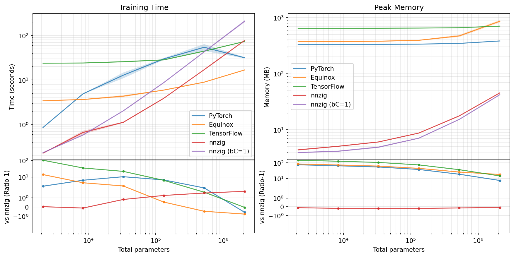

# NNzig

A small, compile-time-configured neural network library written in Zig, with the
heavy linear algebra offloaded to C++/Eigen kernels. Network shape, numeric
precision, and training hyperparameters are all fixed at compile time from a
single ZON config file.

## Features

- Multi-layer perceptron (MLP) with configurable depth and width.
- Mini-batch gradient descent with the Adam optimizer.
- Plugggable activation functions (ReLU, tanh, sigmoid) and losses (MSE).
- Z-score input/output normalization.
- Binary save/load of weights and per-epoch loss curves.
- Compile-time selectable float precision (16/32/64-bit).
- C++/Eigen-accelerated forward, backward, and gradient kernels.

## Requirements

- **[Zig](https://ziglang.org) 0.16.0** — the exact version used in CI.
- A C++ toolchain with libc++ (for the Eigen kernels).
- **[Eigen](https://eigen.tuxfamily.org) 5.0.0** is fetched automatically on the
  first build via `build.zig.zon`; no manual installation needed.

## Usage

1. Configure the network in `params.zon` (network shape, precision, training
   hyperparameters, etc.).
2. Import the library and drive it through the `NN` struct:

```zig
const std = @import("std");
const nnzig = @import("nnzig");
const io = @import("io");

pub fn main(init: std.process.Init) !void {
    const allocator = init.gpa;

    // Create the network (shape/precision come from params.zon)
    var nn = try nnzig.NN.init(allocator, init.io);
    defer nn.deinit();

    // Load training data, then normalize it
    const data = try nn.loadData("data.bin");
    defer {
        allocator.free(data[0]);
        allocator.free(data[1]);
    }
    try nn.computeNormalization(data[0], data[1]);
    try nn.normalize(data[0], data[1]);

    // Train and save the loss history
    try nn.train(data[0], data[1]);
    try nn.saveLosses("losses.bin");
}
```

The public API lives in `src/nnzig.zig`: `init`/`deinit`, `forward`, `train`,
`computeNormalization`/`normalize`/`denormalize`, `save/loadWeights`, and
`saveLosses`. A complete end-to-end example is in `benchmarks/runs/run_nnzig.zig`.

## Configuration

All network behavior is set at compile time in `params.zon`:

| Field           | Description                                              |
| --------------- | -------------------------------------------------------- |
| `precision`     | Float precision: `16`, `32`, or `64`                     |
| `nNeurons`      | Neurons per layer, e.g. `.{ 2, 4, 4, 2 }`                |
| `activations`   | Per-layer activations (`relu`, `tanh`, `sigmoid`, `none`)|
| `lossFunc`      | Loss function (`MSE`)                                    |
| `normalization` | Normalization method (`meanStd`)                         |
| `nEpochs`       | Number of training epochs                                |
| `batchSize`     | Mini-batch size                                          |
| `lr`, `beta1`, `beta2`, `eps` | Adam optimizer hyperparameters            |
| `rTrain`, `rVal`| Train/validation split fractions                         |

Invalid values are caught at build time. See `params.zon` for the full set.

## Testing

```sh
nix run .#test -- --summary all
OR
zig build test --summary all
```

Tests are written inline in each source file and cover every module.

## Documentation

```sh
nix run .#docs
OR
zig build docs
```

Generates API documentation in `zig-out/docs`, also published to GitHub Pages
from the `main` branch.

## Benchmarks

A benchmark compares NNzig against an equivalent PyTorch model.

```sh
nix run .#benchmark
OR
zig build benchmark
```

It reads `benchmarks/dataset_benchmark.bin`, which is gitignored. Generate it
first:

```sh
nix run .#generate-data
```

The benchmark suite includes a PyTorch, Equinox, and TensorFlow references
and loss-plotting script. Use [Nix](https://nixos.org), the provided flake
sets up the Python environment:

```sh
nix run .#generate-data   # generate the dataset
nix run .#run-pytorch     # run the PyTorch reference
nix run .#run-equinox     # run the Equinox reference
nic run .#run-tensorflow      # run the TensorFlow reference
nix run .#plot-losses     # plot both loss curves
nix run .#bench-resources # sweep N: time & peak-RSS vs PyTorch/Equinox/TF
nix run .#plot-resources  # plot the resource-benchmark results
```

`bench-resources` builds nnzig through the same flake (via `.#default`) as the
Python libraries, so the whole sweep is reproducible under Nix with no local
Zig toolchain required.

## Results

The resource benchmark sweeps an `[N, 2N, 2N, N]` MLP across
`N ∈ {16, 32, 64, 128, 256, 512}`, comparing NNzig (full-batch and `bC=1`
variants) against PyTorch, Equinox, and TensorFlow references. As in the plot
below, the horizontal axis is the total number of trainable parameters
(weights + biases), `8N² + 5N`, rather than the raw sweep index `N`. Each
value is reported as `mean ± std` over 5 runs (sample standard deviation,
matching the bands drawn in the plot).

### Training time (seconds)

| Total parameters | PyTorch | Equinox | TensorFlow | nnzig | nnzig (bC=1) |
|----------------:|---:|---:|---:|---:|---:|
|           2,128 | 0.863 ± 0.010 | 3.423 ± 0.031 | 23.785 ± 0.321 | 0.229 ± 0.001 |   0.235 ± 0.002 |
|           8,352 | 4.902 ± 0.063 | 3.650 ± 0.088 | 24.056 ± 0.152 | 0.666 ± 0.064 |   0.584 ± 0.005 |
|          33,088 |12.816 ± 1.896 | 4.341 ± 0.235 | 25.708 ± 0.887 | 1.125 ± 0.030 |   2.036 ± 0.011 |
|         131,712 |29.711 ± 1.470 | 5.934 ± 0.040 | 28.260 ± 0.611 | 3.881 ± 0.055 |   8.719 ± 0.063 |
|         525,568 |54.246 ± 9.413 | 8.949 ± 0.097 | 44.384 ± 1.137 |17.044 ± 0.089 |  42.795 ± 0.659 |
|       2,099,712 |31.507 ± 1.001 |16.818 ± 0.189 | 73.147 ± 0.787 |77.400 ± 0.641 | 208.843 ± 12.211 |

### Peak memory (MB)

| Total parameters | PyTorch | Equinox | TensorFlow | nnzig | nnzig (bC=1) |
|----------------:|---:|---:|---:|---:|---:|
|           2,128 | 332.21 ± 0.13 | 372.60 ± 3.85 | 645.07 ± 0.45 |  4.39 ± 0.12 |  3.93 ± 0.11 |
|           8,352 | 332.52 ± 0.15 | 373.71 ± 5.22 | 645.60 ± 0.17 |  5.09 ± 0.10 |  4.15 ± 0.10 |
|          33,088 | 333.62 ± 0.22 | 379.31 ± 6.70 | 646.65 ± 0.66 |  6.07 ± 0.10 |  4.90 ± 0.15 |
|         131,712 | 336.57 ± 0.38 | 394.20 ± 7.34 | 650.88 ± 0.34 |  8.75 ± 0.05 |  7.09 ± 0.08 |
|         525,568 | 346.92 ± 0.46 | 472.06 ±20.82 | 660.40 ± 0.24 | 17.73 ± 0.11 | 15.35 ± 0.10 |
|       2,099,712 | 383.55 ± 0.62 | 861.91 ±42.94 | 705.23 ± 0.79 | 45.55 ± 0.15 | 42.28 ± 0.05 |



*Training time (left) and peak memory (right) vs total parameters. Top panels
are log-log; bottom panels show each library's ratio relative to nnzig.*

## License

[MIT](LICENSE) © Rodrigo Voivodic
